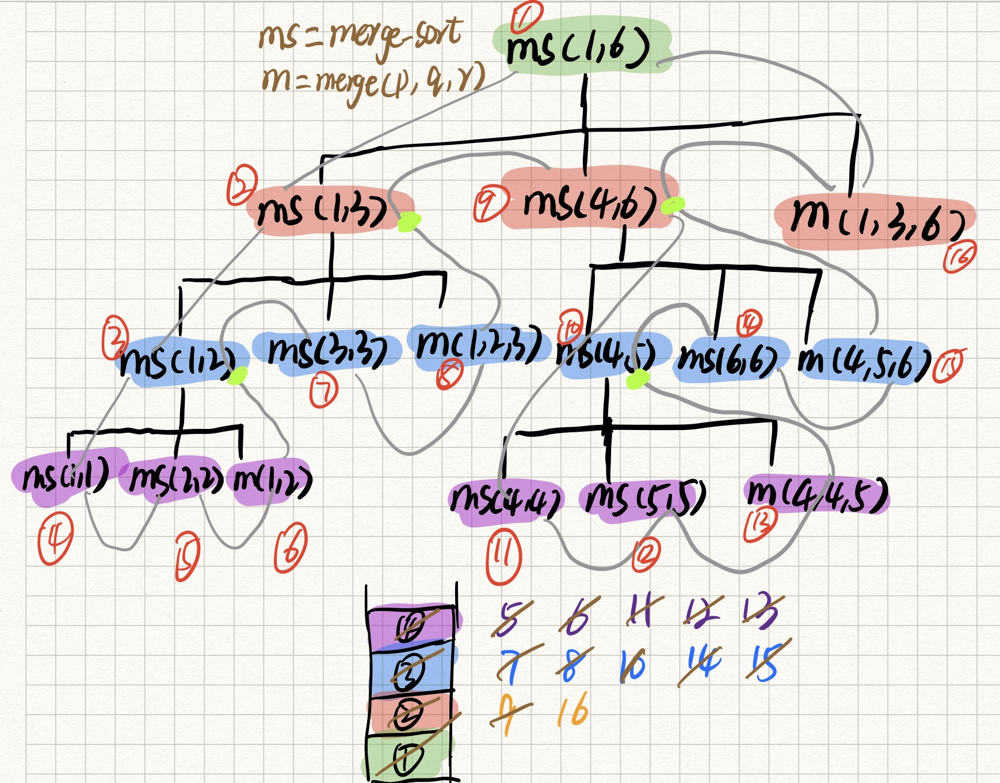
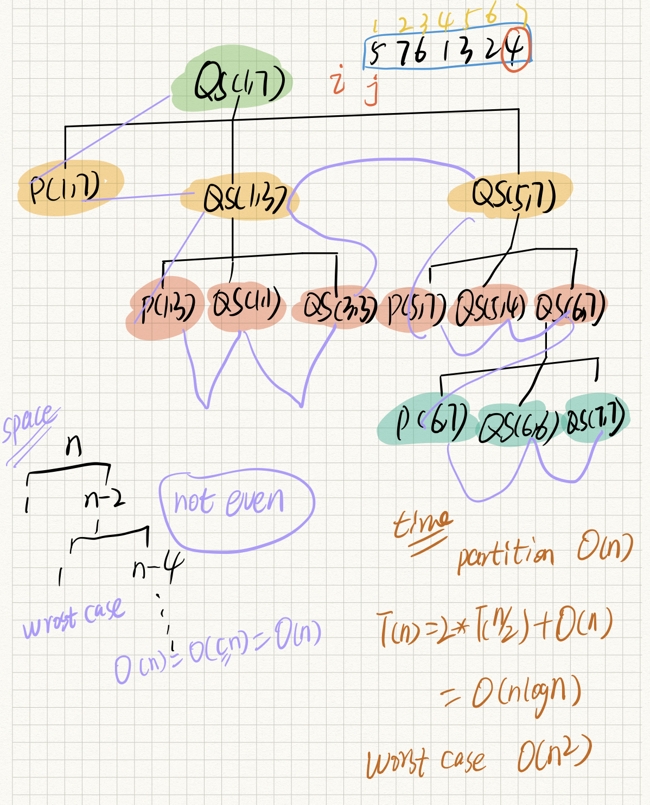

======================
排序算法总结
======================

- **原地排序（Sorted in place）算法**：特指空间复杂度是 O(1) 的排序算法
- **稳定性**：如果待排序的序列中存在值相等的元素，经过排序之后，相等元素之间原有的先后顺序不变

**基于比较的算法**
-------------------------------

``冒泡排序（Bubble Sort）``
^^^^^^^^^^^^^^^^^^^^^^^^^^^^^^^

冒泡排序只会操作相邻的两个数据。每次冒泡操作都会对相邻的两个元素进行比较，看是否满足大小关系要求。
如果不满足就让它俩互换。``一次冒泡会让至少一个元素移动到它应该在的位置`` ，重复 n 次，就完成了 n 个数据的排序工作;

``如同水中气泡向上升``

.. image:: ../_static/images/bubble_sort.jpg

``当某次冒泡操作已经没有数据交换时，说明已经达到完全有序，不用再继续执行后续的冒泡操作，增加一个 flag 标志位来判断``

.. note::

    - 是 ``稳定的算法``

        只有交换才可以改变两个元素的前后顺序。为了保证冒泡排序算法的稳定性，当有相邻的两个元素大小相等的时候，我们不做交换，
        相同大小的数据在排序前后不会改变顺序，所以冒泡排序是稳定的排序算法

    - 是 ``原地算法``，无需额外的空间，空间复杂度为：O(1)

    - 时间复杂度：O(n^2)

        最坏情况时间复杂度：O(n^2)，数组逆序，需要 ``n 次冒泡``

        最好情况时间复杂度：O(n)，数组为有序，只需 ``一次冒泡``

        平均时间复杂度：O(n^2)

.. code:: python

    def bubble_sort(array):
        length = len(array)
        if length <= 1:
            return array
        for i in range(1, length):  # 从第二个元素开始比较
            flag = False
            # 已经经过 i 次冒泡，array[length-i]及之后的数据都是升上去的，已经有序
            for j in range(length-i):
                if array[j] > array[j+1]:
                    array[j], array[j+1] = array[j+1], array[j]
                    flag = True  # 注意冒泡之后，不要忘了修改状态
            if not flag:
                return array

-----------------------------------------------------------------

``插入排序（Insertion Sort）``
^^^^^^^^^^^^^^^^^^^^^^^^^^^^^^^

插入排序，顾明思议，就是通过找到对应位置插入的方式进行排序

.. image:: ../_static/images/insertion_sort.jpg

.. tip::

    想象桌子上顺序排列着，数字朝下的扑克，用右手依次拿起扑克放入左手，左手中的牌都是有序的；如果左手中无牌，直接放进左手；
    如果左手中已经有牌，从 ``小拇指向大拇指`` 方向上的左手牌依次与右手牌比大小，如果右手牌较小，左手牌往小拇指
    方向移动一个位置，给右手牌腾地儿，至于右手牌能不能插入这个位置，还有继续往大拇指方向进行
    比较，直到右手牌比左手牌大，此时左手当前牌的位置 ``+1`` 就是右手牌要插入的位置

.. note::

    - 是 ``稳定的算法``

        对于值相同的元素，我们可以选择将后面出现的元素，插入到前面出现元素的后面，这样就可以保持原有的前后顺序不变

    - 是 ``原地算法``

        无需额外的空间，空间复杂度为：O(1)

    - 时间复杂度：O(n^2)

        插入排序包含两种操作：``比较`` 和 ``移动``:

        最坏情况时间复杂度：O(n^2)，数组是逆序的，每个原来都需要比较 ``i`` 次，移动 ``i`` 次（``i`` 为当前元素下标），
        所以 O(n) = 2*(1) + 2*（2)+ ... + 2*(n-1)，故 O(n) = n^2

        最好情况时间复杂度：O(n)，数组为有序，只需与 ``左边有序部分最后一个元素`` 做一次比较即可

        平均时间复杂度：O(n^2)，每次插入操作都相当于在数组中插入一个数据，循环执行 n 次插入操作，所以平均时间复杂度为 O(n2)

.. code:: python

    def insertion_sort(array):
        length = len(array)
        # 只有一个数，无需排序
        if length <= 1:
            return array
        for i in range(1, length):
            # 右手起牌
            key = array[i]
            # 小拇指位置
            j = i - 1
            while (j >=0 and array[j] > key):
                # 后移一位，给右手牌腾地儿
                array[j+1] = array[j]
                # 下一个要参与比较的左手牌
                j -= 1
            array[j+1] = key
        return array

------------------------------------------------------------

**选择排序（Selection Sort）**
^^^^^^^^^^^^^^^^^^^^^^^^^^^^^^^

选择排序每次会从未排序区间中找到最小的元素，将其放到已排序区间的末尾

.. image:: ../_static/images/selection_sort.jpg

.. note::

    - 不是 ``稳定的算法``

        比如 5，8，5，2，9 这样一组数据，使用选择排序算法来排序的话，第一次找到最小元素 2，
        与第一个 5 交换位置，那第一个 5 和中间的 5 顺序就变了

    - 是 ``原地算法``，无需额外的空间，空间复杂度为：O(1)

    - 时间复杂度：O(n^2

        总的比较次数 N = (n-1)+(n-2)+...+1 = n*(n-1)/2。交换次数 O(n)，最好情况是，已经有序，交换 0 次；最坏情况是，逆序，交换 n-1 次

        最坏情况时间复杂度：O(n^2)，

        最好情况时间复杂度：O(n^2)

        平均时间复杂度：O(n^2)

.. code:: python

    def selection_sort(array):
        length = len(array)
        if length <= 1:
            return array

        for i in range(length):
            min_idx = i
            for j in range(i+1, length):
                if array[min_idx] > array[j]:
                    min_idx = j
            array[i], array[min_idx] = array[min_idx], array[i]
        return array

-------------------------------------------------------------

**归并排序（Merge Sort）**
^^^^^^^^^^^^^^^^^^^^^^^^^^^^^^^

**归并排序的核心思想是先将数组分成两部分，然后将两部分别排序，然后再合并这两个有序的子数组。归并排序使用的是分治思想，将大问题化为小问题，分而治之，利用递归实现**

.. image:: ../_static/images/merge_sort.jpg

**Merge**
#######################

先来解决，如何合并两个有序数组？

.. tip::

    **如果数组 A[p, ..., q, ..., r] 中 A[p,...,q] 是有序的，A[q+1,...,r] 也是有序的，那我们可以把问题看作是合并两个有序数组**

    在两个数组末尾追加一个 ``无穷大``，追加 ``无穷大`` 的作用是：当其中一个数组已经 over 的时候，无需再单独判断，可以继续把另外一个数组
    的剩余元素遍历完。

    然后依次从 L 和 R 的第一个元素开始，比对两个数组中元素大小，并较小值加入临时数组，遍历次数为两数组长度之和。

.. note::

    - 时间复杂度：O(n)，每个元素都需要比较和并移动一次
    - 空间复杂度：O(n)，临时数组容纳两个数组的所有元素

.. code:: python

    def merge(left, right):
        tmp = []
        n = len(left) + len(right)
        left.append(float('inf'))
        right.append(float('inf'))

        i, j = 0, 0
        for k in range(n):
            if left[i] <= right[j]:
                tmp.append[left[i]]
                i += 1
            else:
                tmp.append[right[j]]
                j += 1
        return tmp

**Merge Sort**
#######################

.. tip::

    我们将数组一份为二，分成两个数组，并分别递归调用 merge_sort，最后用上面的 merge 方法将排好序的两个数组合并为一个有序数组。

.. note::

    - 时间复杂度：O(nlogn)

        ``T(n) = 2*T(n/2) + O(n)``，根据主定理得出时间复杂度为 O(nlogn)，无论给定数组是否有序，正序还是逆序，
        时间复杂度都一样。

    - 空间复杂度：O(n)

        ``merge 函数`` 的空间复杂度为 O(n)，通过上图 merge_sort 函数的递归调用栈发现，merge_sort 通过不断的进栈、出栈，
        如果数组有 n 个数，则递归栈的大小为 ``logn + 1`` ，则 merge_sort 所需的空间为 (logn + 1) * k，其中 k 为栈中元素的常量级空间，
        再加上 merge 所需的空间，``O(n) + O(logn)``，所以空间复杂度为 O(n)。

    - ``不是原地算法``，需要额外的空间开销

.. code:: python

    def merge_sort(array):
        length = len(array)
        if length <= 1:
            return

        mid = length // 2
        left = merge_sort(array[0:mid])
        right = merge_sort(array[mid:])
        return merge(left, right)

-------------------------------------------------------------

**快速排序（Merge Sort）**
^^^^^^^^^^^^^^^^^^^^^^^^^^^^^^^

- 如果数量级比较小，快速排序会比归并排序快

- 快速排序也是基于分治思想，与归并排序不同，归并排序总是将数组一分为二，然后分别排序；
  但快速排序的 ``分区点`` 不一定是中点，由 partition 函数计算得到 pivot 位置

.. image:: ../_static/images/partition.jpg

快速排序的核心就是 ``partition 函数``，其原理是：

    我们从数组 ``[p, ... ,r]`` 中选取任意一个元素，通常选择最后一个元素作为 pivot（分区点），
    然后将 ``小于 pivot 的元素都移到 pivot 左边``，将 ``大于 pivot 的元素都移到 pivot 右边``，
    这样，pivot 本身是有序了，他已经找到了自己该在的位置，假设 pivot 目前的下标是 q，那么此时数组就被分为了
    三部分 ``[p, ..., q-1, q, q+1, ..., r]``。

    实现方法是使用指针 i、j，快指针 j 负责遍历元素，找到小于 pivot 的元素，与慢指针 ``i+1`` 位置的元素进行交换，
    为什么要与 ``i+1`` 位置的元素交换，而不是直接将 i 与 j 位置的元素互相交换？因为此时 i、j 位置的元素都小于 pivot，
    直接交互两者，会导致将小于 pivot 的 i 位置元素又扔到了后面位置，所以使用大于 pivot 的 ``i+1`` 位置元素进行交换，
    可以观察到的是，完成一次交换后，``<=i`` 位置的元素都是小于 pivot 的，``[i+1, j]`` 区间的元素都是大于 pivot 的。

    ``i = p - 1``, ``j = p``, 遍历至 ``r-1``，遍历完成后返回 ``i+1`` 就是最后一个元素该在的位置。

.. code:: python

    def partition(array, low, high):
        i= low - 1
        pivot = array[high]
        for j in range(low, high):
            if array[j] <= pivot:
                i += 1
                array[i], array[j] = array[j], array[i]
        array[i+1], array[high] = array[high], array[i+1]
        return i + 1

有了 ``partition`` 函数我们就可以计算 pivot 下标，通过递归来排序

.. note::

    - 空间复杂度：O(n)

    - 时间复杂度：O(nlogn)，最好情况下，每次分区都分出 1 个和剩余元素，就会退化为 O(n^2)

.. code:: python

    def quick_sort(array, low, high):

        if low >= high:
            return

        pivot = partition(array, low, high)
        quick_sort(array, low, pivot-1)
        quick_sort(array, pivot+1, high)

>>> quick_sort(arrary, 0, n-1)
